# Weather App 

## AUTHOR

Edward Reyes

## CONCEPT
This app allows you to search a location and view weather data such has 
temperature, cloud conditions, humidity, wind speeds, wind directions, 
and UV index. The app will also store you previous searched locations,
allowing you to search adn see weather data on that location when clicked
again. The app also display weather information from a 5 day forecast,
displaying similar results as the current weather data.

## User Story
  * AS A traveler
  * I WANT to see the weather outlook for multiple cities
  * SO THAT I can plan a trip accordingly

## Site information Display
  * Display Temperature and weather conditions
  * Display wind speeds, wind directions, UV index, and humidity.

## Process
  ### Front End Development
  * Used HTML, CSS, and Booststrap
  * Used Bootstrap primarily for row/col alignment, centering, spacing, and text color.
  * Used css to tweak spacing, background color, spacing between main-content and footer, and more.
    
  ### Back End Development
  * I used the Open Weather Api as required by this assignment. I used the Current Weather API,
    5-day forecast API, and the current UV Index API in order to get the required data.
  * I used both vanilla javascript, ES6 syntax, jQuery, and Ajax calls to both work with
    the API and display HTML elements, information, button interactions dynamically.

### Technologies used:  
  HTML, CSS, Bootstrap, JavaScript, OpenWeather API, jQuery

## CHALLENGES
  * Mostly working with the layout. This time I did a mobile-first approach which  I wasn't used to.
  * Also keeping the script.js file organzied and not too crowded, while also working one keeping 
    the code overall non-repetitive or D.R.Y.

## LINK TO DEPLOYED APPLICATION / GITHUB

[GitHub Pages](https://edwardreyes29.github.io/WeatherApp/)

[GitHub](https://github.com/edwardreyes29/WeatherApp)

## Screen shots

### Final result
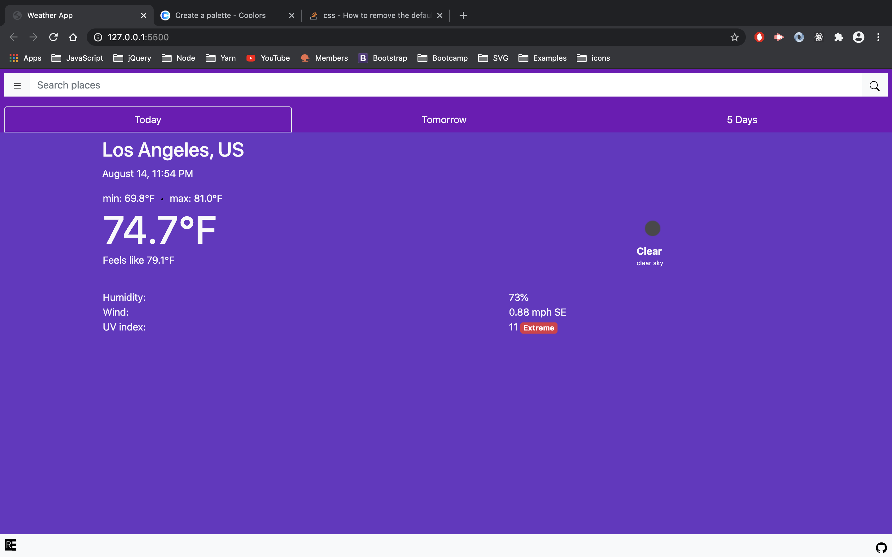

## Prototype stages
### Testing retrieving icons from the API
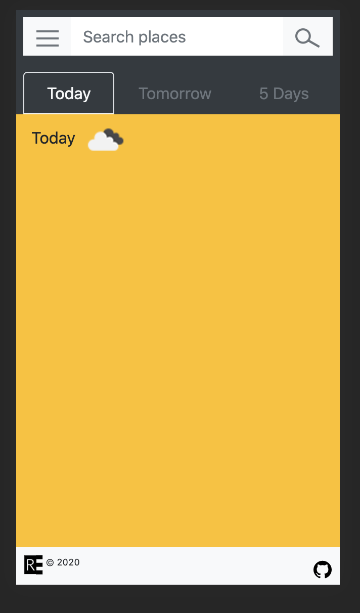

## Testing mobile look of the app. 
### Used bg-colors to visually see spacing of elements
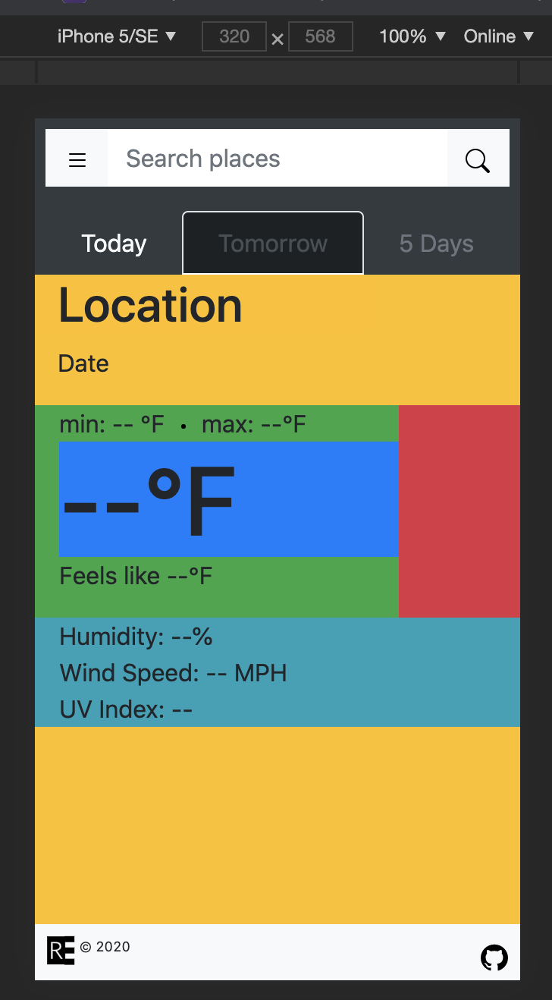

## Final prototype
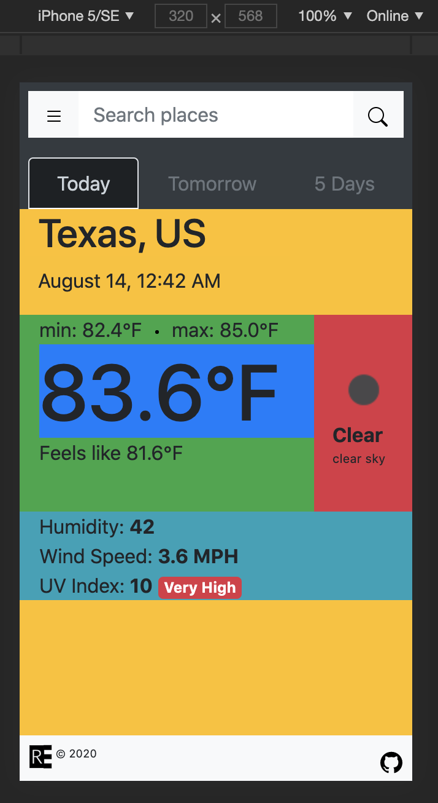

## Tomorrow's Weather
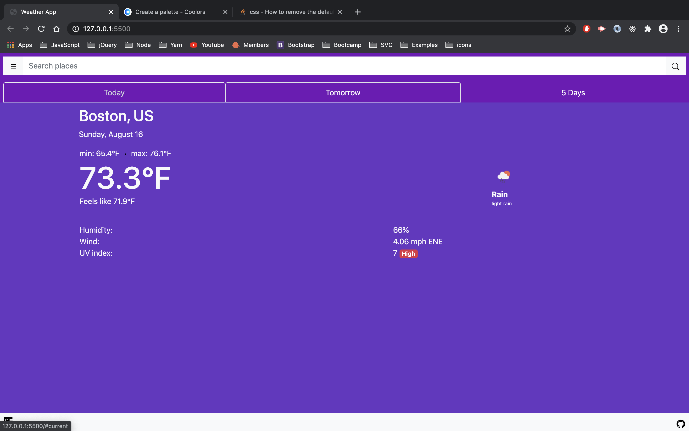

## 5 day forecast
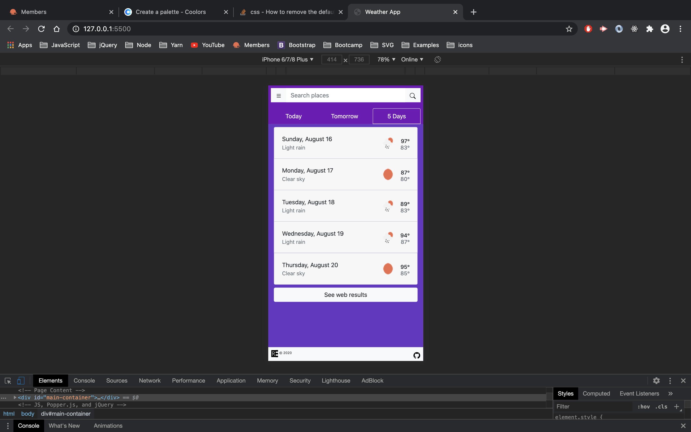

## Search Demos
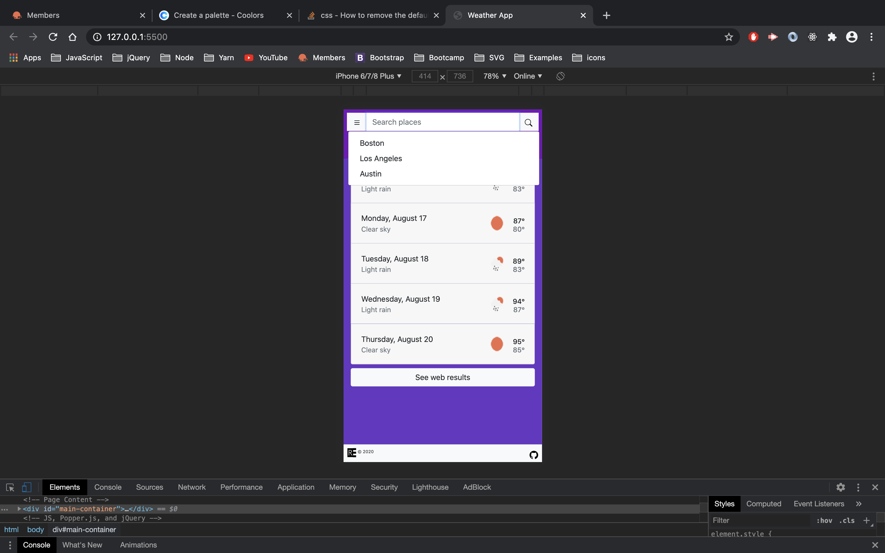
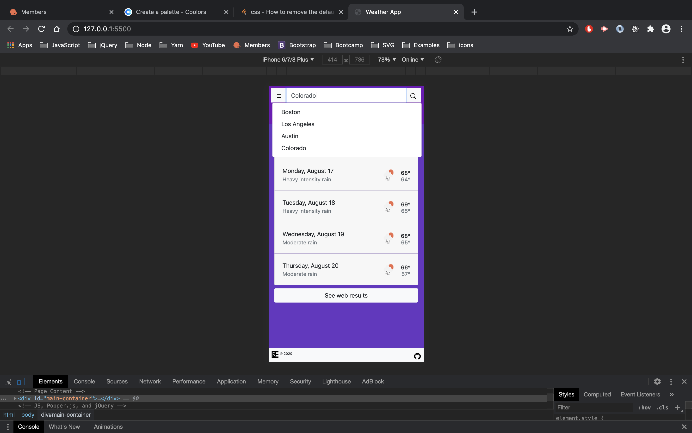

## Changing Displays (UPDATE)
### The current display changes depending on the the time of day a user logs in.
### I doesn't change color dynamically in real time (will work on that maybe)
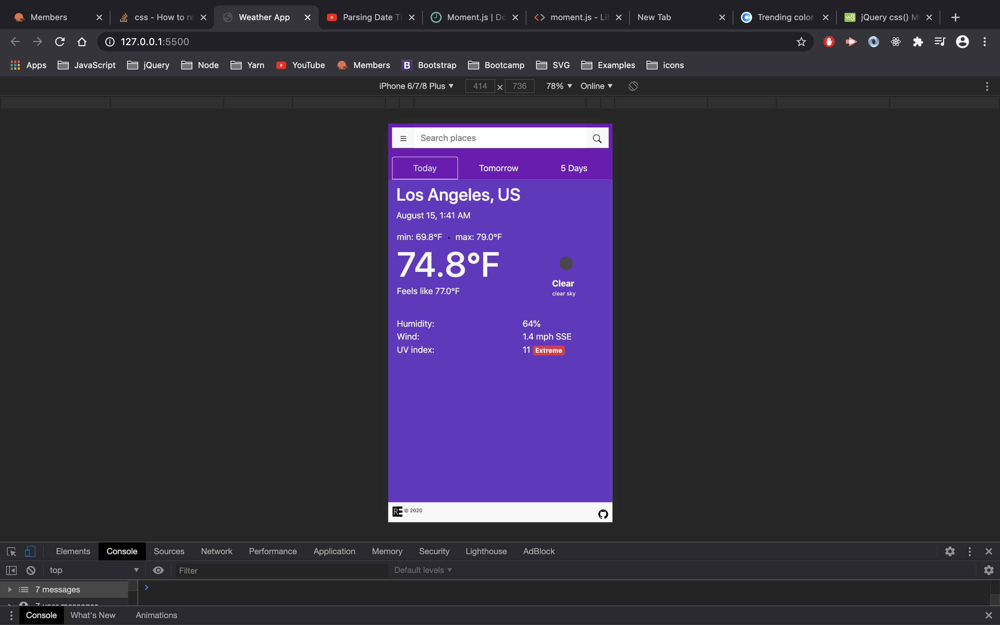
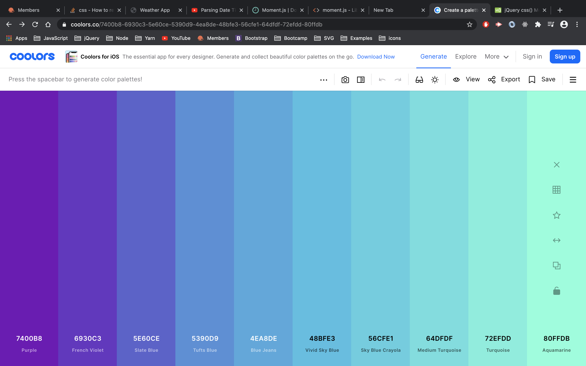

## Tomorrow's design & Five day forecast display
### For both tomorrow's weather and the 5 day forecast displays have fixed colors
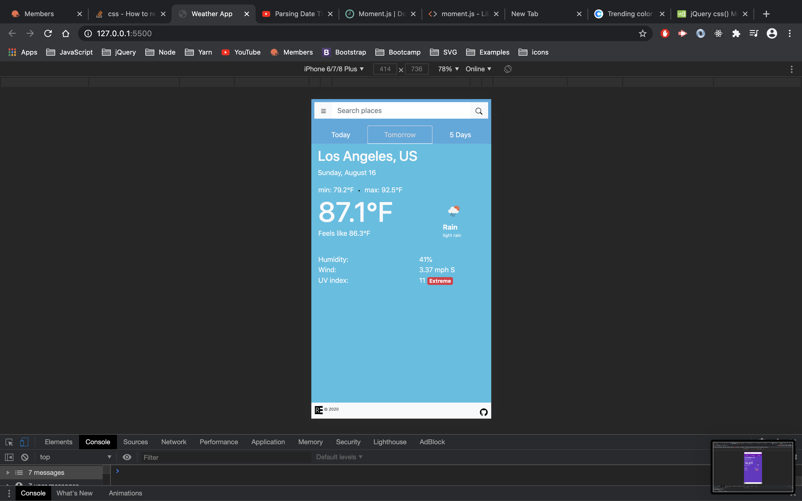
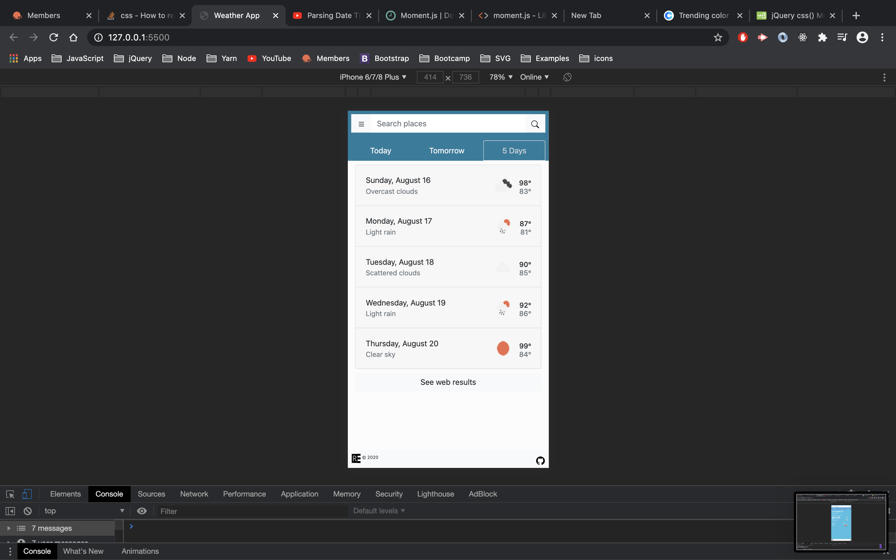
